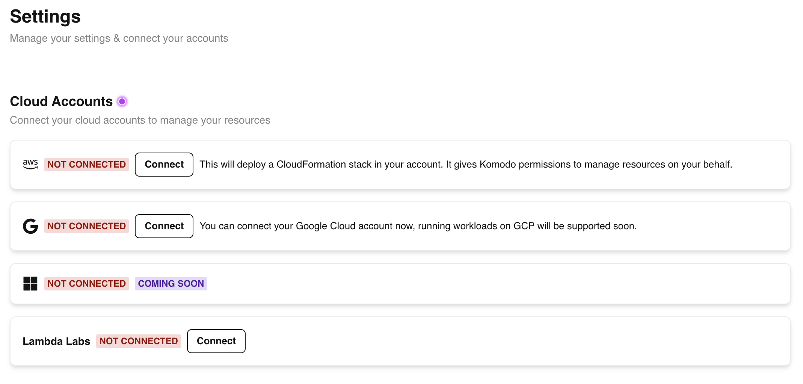
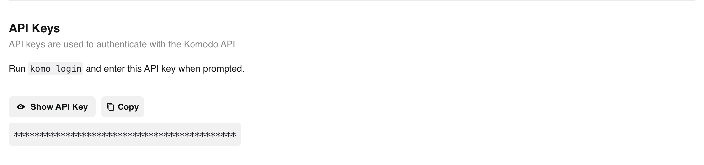

Create an account, connect your cloud account, and start running your workflows in minutes.

### 1. Create an account and connect your cloud

Before you get started, make sure to create an account and connect your cloud account(s).

1. [Sign up](https://app.komodoai.dev) for a free account at [app.komodoai.dev](https://app.komodoai.dev) and log in.
2. Connect a cloud provider on the [Settings](https://app.komodoai.dev/settings) page.



### 2. Install Komodo CLI and authenticate

Install the CLI:

```bash
pip install komo
```

Head to the [Settings](https://app.komodoai.dev/settings) page and copy your API key.



Now login and provide your API key when prompted:

```bash
komo login
```

### 3. Launch a machine

Let's spin up a development machine

Copy the following YAML into a `dev.yaml` file:
```yaml
resources:
  # 1x A10/A10G GPU
  accelerators: {A10G:1, A10:1}

env:
  # set the environment variable MY_ENV_VAR to my-value
  MY_ENV_VAR: my-value

# Copy the contents of the current directory onto the remote machine
workdir: .

# Typical use: pip install -r requirements.txt
# Invoked under the workdir (ie. can use its files)
setup: |
  echo "Running setup operations"

# Start a notebook on the machine
notebook: true
```

And then simply run:

```bash
komo machine launch dev.yaml --name dev
```

Once the machine is launched, you can open the notebook from dashboard.
You can also connect to the machine with SSH or open it in VSCode using
the [CLI](./reference/komo-cli-reference).

### 3. Launch a job - Hello World!

Let's define our very first job, a simple Hello World! program.

Copy the following YAML into a `hello.yaml` file:
```yaml
resources:
  # 1x A10/A10G GPU
  accelerators: {A10G:1, A10:1}

env:
  # set the environment variable MY_ENV_VAR to my-value
  MY_ENV_VAR: my-value

# Copy the contents of the current directory onto the remote machine
workdir: .

# Typical use: pip install -r requirements.txt
# Invoked under the workdir (ie. can use its files)
setup: |
  echo "Running setup operations"

# Typical use: python train.py
# Invoked under the workdir (ie. can use its files)
run: |
  echo 'Hello World!'
```

You'll notice this is the exact same YAML config as the previous one above, with an
additional `run` section. This section defines how to run your job.

To launch this job, simply run:

```bash
komo job launch hello.yaml
```

And that's it! The logs from the job will be streamed by the CLI in real-time, and you can also access them from the [web dashboard](https://app.komodoai.dev). Once the job finishes, the remote instance will be terminated.


### 4. Launch a service

Now let's define our very first service, a simple python HTTP server.

Copy the follwing YAML into a `http-service.yaml` file:

```yaml
resources:
  # 1x A10/A10G GPU
  accelerators: {A10G:1, A10:1}
  # Open port 8000
  ports: [8000]

env:
  # set the environment variable MY_ENV_VAR to my-value
  MY_ENV_VAR: my-value

# Copy the contents of the current directory onto the remote machine
workdir: .

# Typical use: pip install -r requirements.txt
# Invoked under the workdir (ie. can use its files)
setup: |
  echo "Running setup operations"

# Typical uses:
#    torchserve ..
#    python -u -m vllm.entrypoints.openai.api_server ...
# Invoked under the workdir (ie. can use its files)
run: |
  python -m http.server --port 8000

service:
  replica_policy:
    min_replicas: 1
    max_replicas: 5
    # When the average QPS (queries per second) per replica goes above this number,
    # Komodo will dynamically scale up the number of replicas running your service,
    # up to a maximum of max_replicas.
    # Similarly, when the average QPS per replica goes below this number, Komodo will
    # scale down the number of replicas running your service, down to a minimum of min_replicas.
    target_qps_per_replica: 10
  
  readiness_probe:
    # this is the endpoint path within your service that Komodo uses to check if your service is running
    path: /
```

Again, you'll notice this is the exact same YAML config as the previous one above, but this time,
in our `run` section, we start our service on port 8000 (and expose port 8000 in the `resources` section),
and the `service` sections defines the parameters that are used to determine how to scale your service.

To launch this service, simply run:

```bash
komo service launch http-service.yaml --name simple-http-service
```