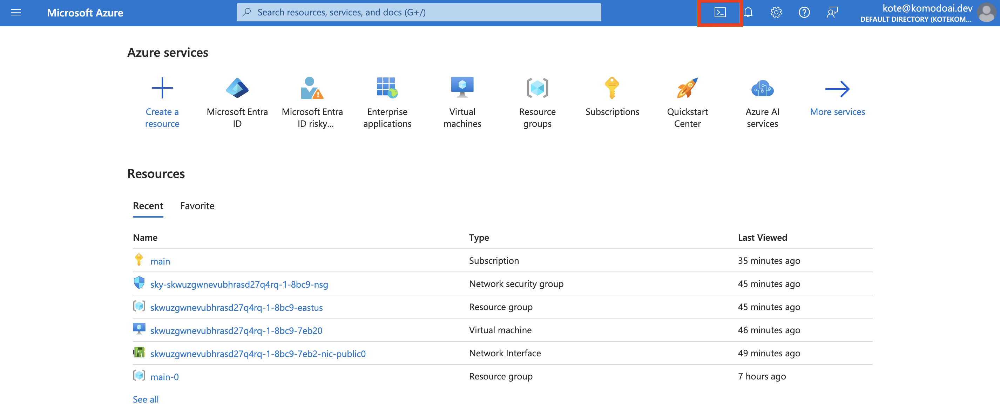

This guide will walk you through the process of creating a service principal in Azure that you can use with Komodo.

### Prerequisites

- **Azure Account**: Ensure you have an Azure account. If you haven't already, you can sign up for free at [Azure](https://azure.microsoft.com/en-us/free).
- **Azure Subscription**: Have an Azure Subscription where you can perform the actions below. Create a subscription by following the instructions [here](https://www.educative.io/answers/how-to-create-a-microsoft-azure-subscription).
- **Azure Cloud Shell Enabled (optional)**: This guide assumes you'll be running commands in an Azure Cloud Shell. You can also run the setup from your local machine.
  - Instructions for enabling Azure Cloud Shell can be found [here](https://learn.microsoft.com/en-us/azure/cloud-shell/get-started/classic?tabs=azurecli)

<Tip>
If you need help with anything below, please let us know on [Discord](https://discord.gg/baJGK6RKZC)! 😊
</Tip>

### Create a Service Principal

1. Log in to the [Azure Portal](https://portal.azure.com/) and start Cloud Shell from the top navigation of the Azure Portal





2. Create a Service Principal by running the script below
```bash
export SUBSCRIPTION_ID=$(az account show | jq -r ".id")
az ad sp create-for-rbac --name komodo-sp \
  --role owner \
  --scopes /subscriptions/$SUBSCRIPTION_ID
```

<Warning>
If after running the above command you see a `Failed to connect to MSI.
Please make sure MSI is configured correctly.` error, run `az login` and follow instructions to log in.
</Warning>

<Accordion title="What permissions will the service principal have?">
  The service principal will be assigned the "Owner" role, granting it full
  permissions on resources in the current subscription. This level of access is
  typically necessary for broad management tasks. However, if your specific use
  case requires more tailored and scoped down permissions, please let us know on
  [Discord](https://discord.gg/baJGK6RKZC) or via email [hello@komodoai.dev](mailto:hello@komodoai.dev)! :)
</Accordion>


The above command will create a Service Principal and output credentials:
```json
{
  "appId": "aaaaaaaaa-bbbb-cccc-dddd-eeeeeeeeeeee",
  "displayName": "komodo-sp",
  "password": "aaaa~~bbbbbbbbbbbbbbbbbbbbbbbbb_ccccccc",
  "tenant": "aaaaaaaa-bbbb-cccc-dddd-eeeeffff"
}
```

3. Copy the credentials and save them as a JSON file

Copy the output from Step 2 and save it as a JSON file locally.

### Upload the Service Principal

1. In the Komodo console, navigate to the [Settings](https://app.komodoai.dev/settings) page

2. Click `Connect` in the Azure section and upload the Service Principal credentials file.

And that's it! You can now launch your workloads on Azure through Komodo! Follow [this tutorial](../../quickstart) to get started.

### FAQ

<Accordion title="What is a Service Principal in Azure?">
A service principal in Azure is a security identity used by applications, services, and automation tools to access specific Azure resources with defined permissions. It acts like a user identity but is specifically created for non-human usage.
</Accordion>
