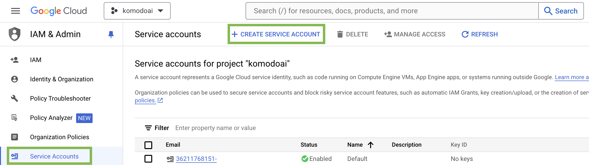

This guide will walk you through the process of creating a service account in Google Cloud Platform (GCP), enabling the necessary services, and configuring permissions so you can use it with our service.

### Prerequisites

- **Google Cloud Account:** Ensure you have a Google Cloud account. If you haven’t already, you can sign up for free at [Google Cloud Console](https://console.cloud.google.com).
- **GCP Project:** Have a GCP project created where you can perform the actions described below. Create a project [here](https://console.cloud.google.com/projectcreate) if needed.
- **Compute Engine Enabled:** Make sure that Compute Engine is enabled in your GCP project. If it is not enabled, you can do so [here](https://console.cloud.google.com/marketplace/product/google/compute.googleapis.com).

<Tip>
If you need help with anything below, please let us know on [Discord](https://discord.gg/baJGK6RKZC)! 😊
</Tip>

### Create a Service Account

1. Log in to the [Google Cloud Console](https://console.cloud.google.com/) and select your project form the drop-down menu at the top of the page.

Click the `Service Accounts` tab on the [IAM & Admin console](https://console.cloud.google.com/iam-admin/iam), and click on **CREATE SERVICE ACCOUNT**.

2. Set the service account id to `skypilot-v1` and click **CREATE AND CONTINUE**.

3. Grant the Service Account an Owner role

On the "Grant this service account access to the project" section, click the "Select a role" dropdown. Type "Owner" into the search box and select the "Owner" role from the list. Click "Continue" to proceed.

### Create a Key for the Service Account

1. In `Service Accounts` you will see your newly-created Service Account. Click on it and navigate to the **KEYS** tab.

2. Click on **ADD KEY** and then **Create new key**

3. Choose **JSON** as the key type and click **Create**

This will download the generated key JSON file on your machine.

### Upload the created Service Account key to Komodo

1. In the Komodo console, navigate to the [Settings](https://app.komodo.io/settings) page

2. Click `Connect` in the GCP section and upload the Service Account key file.

And that's it! You can now launch your workloads on GCP through Komodo! Follow [this tutorial](../../quickstart) to get started.

### FAQ

<Accordion title="What is a Service Account?">
  A service account is a non-personal Google Cloud account used by applications
  or servers to authenticate and perform automated tasks with specific
  permissions.
</Accordion>

<Accordion title="What permissions will the service account have?">
  The service account will be assigned the "Owner" role, granting it full
  permissions across all resources in the project. This level of access is
  typically necessary for broad management tasks. However, if your specific use
  case requires more tailored permissions, please let us know on
  [Discord](https://discord.gg/baJGK6RKZC)! :)
</Accordion>
